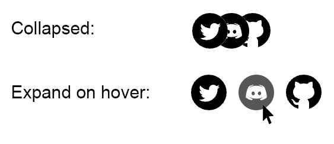

# React Overlap



`react-overlap` is a React component that creates a hover effect where images or SVG graphics overlap each other. Use this component is to display logos or icons in a compact space that expands on hover.

## Installation

```bash
npm install react-overlap
```

```bash
yarn add react-overlap
```

## Using SVG Images

```javascript
import React from 'react';
import { OverlapHover, OverlapHoverSvg } from 'react-overlap';

import DiscordSvg from './img/svg/Discord.svg';
import GithubSvg from './img/svg/Github.svg';
import TwitterSvg from './img/svg/Twitter.svg';

const logoData = [
  {
    svg: GithubSvg,
    href: 'https://github.com/givepraise/praise',
    alt: 'Github',
  },
  {
    svg: DiscordSvg,
    href: 'https://discord.gg/U2ydzXBG6C',
    alt: 'Discord',
  },
  {
    svg: TwitterSvg,
    href: 'https://twitter.com/givepraise',
    alt: 'Twitter',
  },
];

const App = () => {
  return (
    <OverlapHover size={30} spacing={10} overlap={0.4} direction="left">
      {logoData.map((data, index) => (
        <OverlapHoverSvg
          key={index}
          alt={data.alt}
          href={data.href}
          className="opacity-100 hover:opacity-70" // Optional, tailwind example
          svg={data.svg}
        />
      ))}
    </OverlapHover>
  );
};

export default App;
```

## Using PNG Images

```javascript
import React from 'react';
import { OverlapHover, OverlapHoverImage } from 'react-overlap';

import DiscordPng from './img/png/Discord.png';
import GithubPng from './img/png/Github.png';
import TwitterPng from './img/png/Twitter.png';

const logoData = [
  {
    img: GithubPng,
    href: 'https://github.com/givepraise/praise',
    alt: 'Github',
  },
  {
    img: DiscordPng,
    href: 'https://discord.gg/U2ydzXBG6C',
    alt: 'Discord',
  },
  {
    img: TwitterPng,
    href: 'https://twitter.com/givepraise',
    alt: 'Twitter',
  },
];

const App = () => {
  return (
    <OverlapHover size={30} spacing={10} overlap={0.4} direction="right">
      {logoData.map((data, index) => (
        <OverlapHoverImage
          key={index}
          alt={data.alt}
          href={data.href}
          className="opacity-100 hover:opacity-70" // Optional, tailwind example
          src={data.img}
        />
      ))}
    </OverlapHover>
  );
};

export default App;
```

## Animation direction

To change the direction of the animation, pass the direction prop with either "left" or "right" (default is "right").

```javascript
<OverlapHover direction="left">
  // Your OverlapHoverImage or OverlapHoverSvg components
</OverlapHover>
```

## Dark Mode

The OverlapHover component supports dark mode, which can be enabled by setting the `darkMode` prop to `true`. When dark mode is enabled, the component will invert the colors of the images or SVGs to provide better contrast and visibility against a dark background.

To enable dark mode, simply pass the `darkMode` prop to the `OverlapHover` component:

```jsx
<OverlapHover darkMode={true}>
  // Your OverlapHoverImage or OverlapHoverSvg components
</OverlapHover>
```

## `OverlapHover` Props

| Prop      | Type   | Default | Description                                                                                 |
| --------- | ------ | ------- | ------------------------------------------------------------------------------------------- |
| direction | string | "right" | The direction of the animation on hover. Can be "left" or "right"                           |
| size      | number | 25      | The size of the images or SVGs in pixels                                                    |
| spacing   | number | 16      | The spacing between images or SVGs in pixels                                                |
| overlap   | number | 0.33    | The overlap percentage                                                                      |
| darkMode  | bool   | false   | Whether to enable dark mode or not. By default, darkmode inverts the colours of the images. |

## License

MIT
